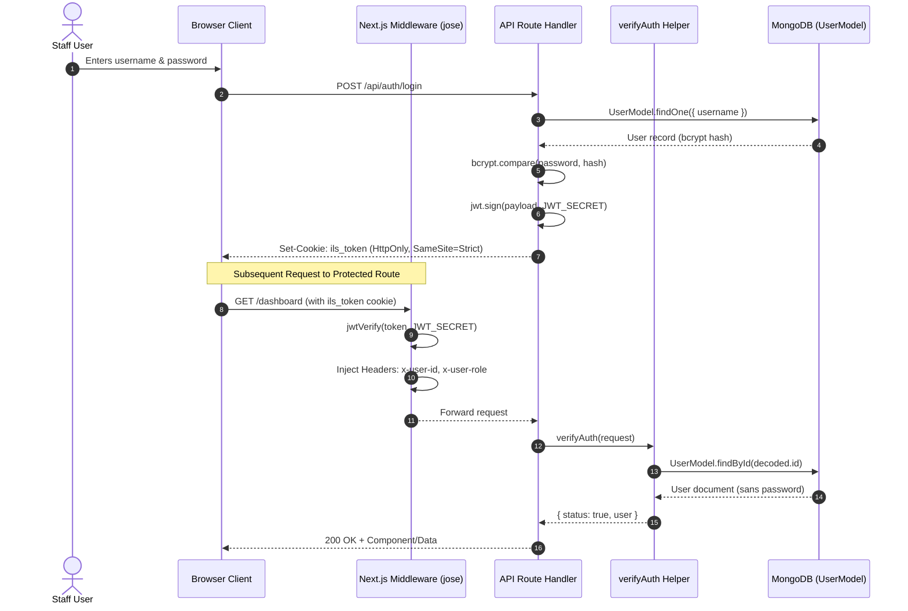
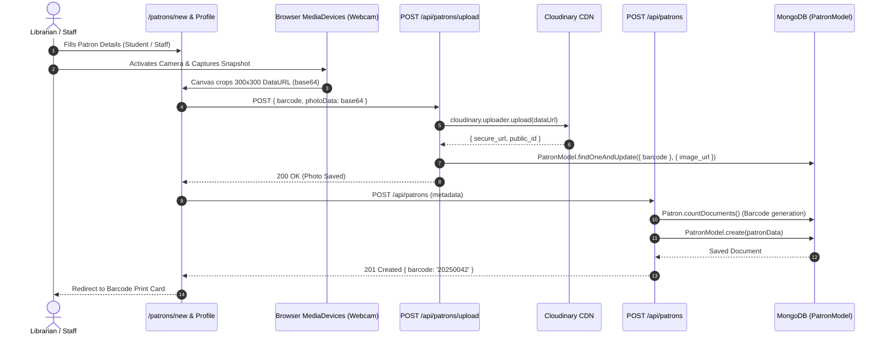
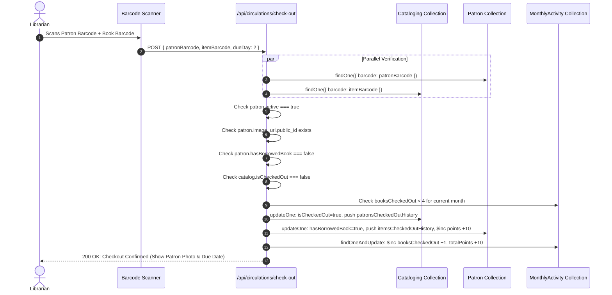
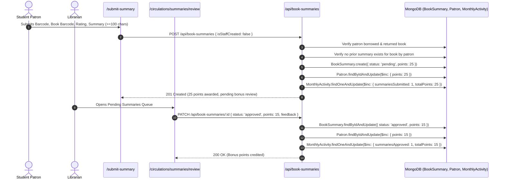
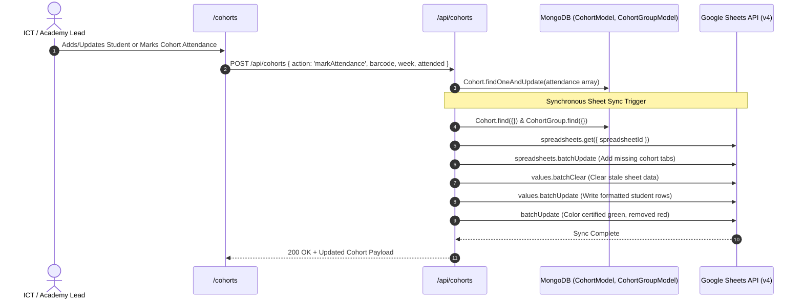
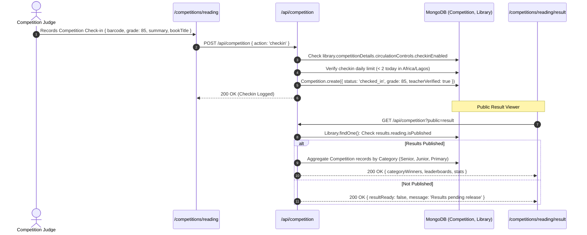

# DZF-ILS: Comprehensive System Audit, Architecture Specification & Rebuild Guide

> **Target Version:** Clean Rewrite from Scratch  
> **Retained Assets:** Mongoose Models (`src/models/`), Environment Variables (`.env`), and this Document  
> **Author:** Antigravity System Architecture Review  
> **Date:** October 2026  

---

## Table of Contents

1. [Executive Summary & System Context](#1-executive-summary--system-context)
2. [Complete Functional Inventory & Feature Breakdown](#2-complete-functional-inventory--feature-breakdown)
   - [2.1 Authentication, Staff Identity & Access Control (RBAC)](#21-authentication-staff-identity--access-control-rbac)
   - [2.2 Patron Lifecycle Management & Barcode Identity](#22-patron-lifecycle-management--barcode-identity)
   - [2.3 Cataloging & Library Inventory](#23-cataloging--library-inventory)
   - [2.4 Circulation Engine (Checkout, Checkin, Holds, Overdues, Renewals)](#24-circulation-engine)
   - [2.5 Book Summaries & Gamified Reading Engagement](#25-book-summaries--gamified-reading-engagement)
   - [2.6 Class Attendance Tracking & Scanner Operations](#26-class-attendance-tracking--scanner-operations)
   - [2.7 Monthly Activity Aggregator & Leaderboard System](#27-monthly-activity-aggregator--leaderboard-system)
   - [2.8 Cohort Academy & Google Sheets Synchronization](#28-cohort-academy--google-sheets-synchronization)
   - [2.9 Reading Competitions & Live Results Engine](#29-reading-competitions--live-results-engine)
   - [2.10 Admin Control Center & Emergency Overrides](#210-admin-control-center--emergency-overrides)
   - [2.11 Transcomm (Values & Leadership Knowledge Hub)](#211-transcomm-values--leadership-knowledge-hub)
   - [2.12 Certificate Studio (Vector Templates & Export Pipeline)](#212-certificate-studio-vector-templates--export-pipeline)
   - [2.13 Public Statistics & Interoperability API](#213-public-statistics--interoperability-api)
3. [End-to-End Data Flow Architecture (Client ↔ Server ↔ Database)](#3-end-to-end-data-flow-architecture)
   - [3.1 Authentication & Request Verification Flow](#31-authentication--request-verification-flow)
   - [3.2 Patron Registration, Camera Photo Capture & Cloudinary Upload Flow](#32-patron-registration-camera-photo-capture--cloudinary-upload-flow)
   - [3.3 Circulation Checkout & Checkin Transaction Flow](#33-circulation-checkout--checkin-transaction-flow)
   - [3.4 Book Summary Submission, Moderation & Scoring Flow](#34-book-summary-submission-moderation--scoring-flow)
   - [3.5 Cohort Attendance & Google Sheets Sync Pipeline](#35-cohort-attendance--google-sheets-sync-pipeline)
   - [3.6 Competition Session Tracking, Grading & Public Leaderboard Flow](#36-competition-session-tracking-grading--public-leaderboard-flow)
4. [Exhaustive Codebase Audit: Bugs, Vulnerabilities & Anti-Patterns](#4-exhaustive-codebase-audit-bugs-vulnerabilities--anti-patterns)
   - [4.1 Critical Authentication & Session Discrepancies](#41-critical-authentication--session-discrepancies)
   - [4.2 Security, Authorization & Exposed Endpoints](#42-security-authorization--exposed-endpoints)
   - [4.3 Data Integrity, Race Conditions & Distributed Transaction Failures](#43-data-integrity-race-conditions--distributed-transaction-failures)
   - [4.4 Schema Design Inconsistencies & Typo Debt](#44-schema-design-inconsistencies--typo-debt)
   - [4.5 Performance, Scaling & Memory Bottlenecks](#45-performance-scaling--memory-bottlenecks)
   - [4.6 UI/UX & Routing Anomalies](#46-ui-ux--routing-anomalies)
5. [What NOT to Do in the New Web App (Architectural Red Lines)](#5-what-not-to-do-in-the-new-web-app)
6. [Target Architecture & Migration Blueprint for the Clean Rebuild](#6-target-architecture--migration-blueprint-for-the-clean-rebuild)
   - [6.1 Recommended Modern Stack & Tools](#61-recommended-modern-stack--tools)
   - [6.2 Schema & Model Refinements (Carrying Over Models Safely)](#62-schema--model-refinements)
   - [6.3 Clean Architecture Directory Layout](#63-clean-architecture-directory-layout)
   - [6.4 Step-by-Step Implementation Roadmap](#64-step-by-step-implementation-roadmap)
7. [Comprehensive Visual Design System & List View Color Specifications](#7-comprehensive-visual-design-system--list-view-color-specifications)
   - [7.1 Brand Foundations & Core Surface Palette](#71-brand-foundations--core-surface-palette)
   - [7.2 Global Component Variants (Badges, Buttons, Inputs, Tables)](#72-global-component-variants-badges-buttons-inputs-tables)
   - [7.3 List Views & Data Tables Color Mapping Matrix](#73-list-views--data-tables-color-mapping-matrix)
   - [7.4 Modernized Semantic Design Tokens for Clean Rebuild](#74-modernized-semantic-design-tokens-for-clean-rebuild)

---

## 1. Executive Summary & System Context

**Dzuels Integrated Library System (DZF-ILS)** is a centralized institutional platform built for the **Dzuels Educational Foundation (DZF)** in Nigeria. The system serves a dual mandate:
1. **Core Library & Circulation Management:** Managing book acquisitions, Dewey Decimal cataloging, member registration with passport verification, physical item checkouts, returns, renewals, and overdue penalization.
2. **Community & Academy Operations:** Digital Literacy cohorts, student attendance logging, reading competitions with custom grading scales, gamified patron activity scoring (points and leaderboard rankings), staff leadership articles (TRANSCOMM), certificate generation, and live Google Sheets cloud backups.

### Rebuild Context
The existing repository has accumulated architectural drift, conflicting auth strategies, unindexed collections, desynchronized schemas, and edge runtime bugs. Because the project is being **rebuilt completely from scratch**, this audit documents every business rule, domain interaction, edge case, and architectural failure. 

**Assets Carried Over Into the Rebuild:**
1. The Domain Data Models (`src/models/*`)
2. Environment Configuration (`.env`)
3. This Document (`SYSTEM_AUDIT_AND_REBUILD_SPECIFICATION.md`)

---

## 2. Complete Functional Inventory & Feature Breakdown

### 2.1 Authentication, Staff Identity & Access Control (RBAC)
- **Staff Accounts (`UserModel`):**
  - Roles: `admin`, `asst_admin`, `ict`, `librarian`, `ima`, `facility`.
  - Default activation state: Newly registered accounts have `active: false`. Only an `admin` can activate an account before login is permitted.
  - Password hashing via `bcryptjs` (salt rounds: 10).
  - Anti-timing attack delay padding on login/register endpoints.
- **RBAC Permission Matrix:**

| Feature / Action | Admin | Asst Admin | ICT | Librarian | IMA | Facility |
| :--- | :---: | :---: | :---: | :---: | :---: | :---: |
| View All Patrons (inc. Inactive) | ✅ | ✅ | ✅ | ✅ | ❌ | ❌ |
| Activate / Deactivate Patrons | ✅ | ✅ | ✅ | ❌ | ❌ | ❌ |
| Permanently Delete Patrons | ✅ | ❌ | ❌ | ❌ | ❌ | ❌ |
| Edit Patron Details | ✅ | ✅ | ✅ | ✅ | ❌ | ❌ |
| Catalog Management (Add/Edit) | ✅ | ✅ | ✅ | ✅ | ❌ | ❌ |
| Delete Catalog Item | ✅ | ❌ | ❌ | ❌ | ❌ | ❌ |
| Book Checkout & Checkin | ✅ | ✅ | ✅ | ✅ | ❌ | ❌ |
| Mark Class Attendance | ✅ | ✅ | ✅ | ✅ | ❌ | ❌ |
| Review Book Summaries | ✅ | ✅ | ✅ | ✅ | ❌ | ❌ |
| Cohort Management & Google Sync | ✅ | ✅ | ✅ | ❌ | ✅ | ❌ |
| Competition Controls & Publishing| ✅ | ❌ | ❌ | ❌ | ❌ | ❌ |
| Circulation Emergency Overrides | ✅ | ✅ | ✅ | ❌ | ❌ | ❌ |

---

### 2.2 Patron Lifecycle Management & Barcode Identity
- **Patron Categories (`PatronModel`):**
  - `student`: Requires student school details (school name, class, school address, principal name, school contact) and parent/guardian info (parent name, address, phone number, email, relationship).
  - `teacher` & `staff`: Requires employer details and workplace verification.
  - `guest`: Temporary membership.
- **Barcode Scheme:**
  - Auto-generated alphanumeric string formatted as `YYYYXXXX` (e.g., `20250001`).
- **Account Validity & Expiry:**
  - `student` / `guest`: 2 years validity from registration date.
  - `teacher` / `staff`: 5 years validity.
- **Passport Photo Verification Gate:**
  - Every patron must have a passport photo captured or uploaded.
  - Client utilizes HTML5 `navigator.mediaDevices.getUserMedia` for instant camera capture with client-side canvas crop (300x300 square).
  - Server uploads binary image to **Cloudinary** under the folder `library_patrons` with public ID `${patronType}_${firstname}_${barcode}`.
  - **Hard Business Rule:** A patron without an uploaded Cloudinary passport photo (`patron.image_url.public_id`) is strictly forbidden from borrowing any book.
- **Deletion Protection:**
  - Permanent patron deletion is restricted to Admins.
  - Admins must confirm deletion by typing `DELETE <barcode>` verbatim in a modal.
  - Patrons with an active checked-out book cannot be deleted.
  - Deletion is executed as a soft delete (`is18: true`, `active: false`).
- **Barcode Badge Generator & Printing:**
  - Batch and individual generation using `JsBarcode` (format `ITF`, width 2, height 60).
  - Printable membership badge cards with organization header, patron photo, name, and barcode.
  - Export capabilities: PNG download via `html2canvas` or raw browser print window.

---

### 2.3 Cataloging & Library Inventory
- **Item Identification (`CatalogingModel`):**
  - Unique physical item barcode (e.g., scanned ISBN or proprietary library sticker).
  - Unique Institutional Control Number (classification tag).
  - Dewey Decimal or internal Classification numbering.
  - Metadata: Title, Subtitle, Main Author, Additional Authors, Publisher, Place of Publication, Publication Year, Language (default: English), Physical Description (pages, dimensions), Holdings count.
  - Subject tags and Genre terms (`indexTermGenre`).
- **Catalog Operations:**
  - Paginated search with multi-field filtering (Title, Subtitle, Author, Classification, Control Number, Barcode).
  - Real-time availability indicator: `Available` vs `Checked Out`.
  - Detailed circulation history per item showing all past borrowers with timestamps.

---

### 2.4 Circulation Engine
- **Check-Out (`/api/circulations/check-out`):**
  - **Pre-Conditions:**
    1. Patron exists and is `active: true`.
    2. Patron has a valid passport photo on file.
    3. Patron does not have an active loan (`hasBorrowedBook: false`). Strict rule: **Maximum 1 book borrowed at a time**.
    4. Patron has not exceeded the calendar month borrowing limit: **Maximum 4 books per month**.
    5. Catalog item exists and is not currently checked out (`isCheckedOut: false`).
  - **Actions:**
    1. Calculates due date (Current date + `dueDay`, default: 2 days).
    2. Updates `Cataloging`: sets `isCheckedOut: true`, `checkedOutBy: patron._id`, `checkedOutAt`, pushes record to `patronsCheckedOutHistory`, sets `lastBorrowedBy`.
    3. Updates `Patron`: sets `hasBorrowedBook: true`, pushes record to `itemsCheckedOutHistory`, updates `lastBorrowedItem`.
    4. Awards **10 points** to patron.
    5. Upserts `MonthlyActivity`: increments `booksCheckedOut` by 1 and `totalPoints` by 10.
- **Check-In (`/api/circulations/check-in`):**
  - **Pre-Conditions:**
    1. Patron exists.
    2. Catalog item exists and is currently checked out (`isCheckedOut: true`).
    3. Validates that the returning patron is the one who checked out the book.
  - **Actions:**
    1. Updates `Cataloging`: sets `isCheckedOut: false`, clears `checkedOutBy`, marks `returnedAt` on the latest `patronsCheckedOutHistory` entry.
    2. Updates `Patron`: sets `hasBorrowedBook: false`, marks `returnedAt` on the matching `itemsCheckedOutHistory` entry, clears `lastBorrowedItem`.
    3. Awards return points (default 15 in legacy docs, configured to 3-15 in API).
    4. Upserts `MonthlyActivity`: increments `booksReturned` by 1 and updates points.
- **Holds & Historical Logs (`/api/circulations/holds`):**
  - Global query flattening all checkout events across the entire catalog to display active and historic borrowings.
- **Overdues Engine (`/api/circulations/overdues`):**
  - Identifies all items where `isCheckedOut: true` and the latest checkout `dueDate < CurrentDate`.
  - Calculates `overdueDays = Math.ceil((today - dueDate) / 86400000)`.
  - Sorts descending by `overdueDays` to prioritize severe delinquencies.
- **Renewals (`/api/circulations/renew`):**
  - Extends the `dueDate` for an actively borrowed item without requiring physical check-in.
  - Verifies the loan is currently active and borrower matches.
  - Updates `dueDate` on both `Cataloging` and `Patron` history entries and sets `renewedAt`. No points awarded.

---

### 2.5 Book Summaries & Gamified Reading Engagement
- **Public Student Submissions (`/submit-summary`):**
  - Publicly accessible page (students do not require staff credentials).
  - Validation: Summary text must be at least 100 characters; rating 1 to 5 stars.
  - Verification: Patron must have actually borrowed and **already returned** the book.
  - Quota: Maximum 4 summaries submitted per calendar month per student.
  - Uniqueness: Exactly **one summary per patron per book for life**.
  - Initial Award: Automatically awards **25 base points** immediately upon submission with status `pending`.
- **Staff-Created Summaries (`/circulations/summaries`):**
  - Staff can directly record a book summary on behalf of a student.
  - Automatically marked as `approved`.
  - Awards 25 base points + customizable bonus (1 to 20 points).
- **Staff Review & Approval (`/api/book-summaries/[id]`):**
  - Staff reviews pending summaries.
  - Actions: `approved` (with 1-20 bonus points and written feedback) or `rejected`.
  - Approving awards bonus points to patron and increments `summariesApproved` in `MonthlyActivity`.

---

### 2.6 Class Attendance Tracking & Scanner Operations
- **Class Categorization (`AttendanceModel`):**
  - Class Types: `literacy`, `reading_club`, `book_discussion`, `workshop`, `other`.
  - Class Cohorts: Early Elementary (P1-3), Upper Elementary (P4-6), Junior Secondary (JSS1-3), Senior Secondary (SS1-3), Mixed Age, Adult Literacy.
- **Barcode Scanner Fast-Mode:**
  - Barcode input automatically remains focused; barcode scanner emits Enter key to submit.
  - Instant audio-visual confirmation and form reset ready for the next student.
- **Scoring & Rules:**
  - Fixed **20 points** awarded per attendance session.
  - Deduplication: Prevents double-marking the same patron for the same class on the same calendar day.
  - Increments `classesAttended` and `pointsFromAttendance` in `MonthlyActivity`.

---

### 2.7 Monthly Activity Aggregator & Leaderboard System
- **Activity Score Formula:**
  $$\text{Score} = (\text{CheckedOut} \times 10) + (\text{Returned} \times 15) + (\text{Classes} \times 20) + (\text{SummariesApproved} \times 25) + (\text{TotalPoints} \times 1)$$
- **Monthly Rollup (`MonthlyActivityModel`):**
  - One document per patron per calendar month (`patronId`, `year`, `month`).
  - Tracks granular sub-scores (`pointsFromBooks`, `pointsFromAttendance`, `pointsFromSummaries`).
- **Public & Staff Leaderboards:**
  - Top 3 Podium (Gold, Silver, Bronze) with visual styling.
  - Ranked list of top readers.
  - Inactive Patrons report: Identifies registered students with zero activity for the selected month to enable library staff outreach.

---

### 2.8 Cohort Academy & Google Sheets Synchronization
- **Academy Cohort Structure (`CohortModel`, `CohortGroupModel`):**
  - Organizes digital skills learners into groups (e.g., Coding, Office Suite, Literacy).
  - Tracks individual student progress, weekly class attendance, and certificate qualification (`receivedCertificate: true/false`).
  - Supports moving students between cohorts or marking them as removed (`isRemoved: true`).
- **Google Sheets Two-Way/Push Integration:**
  - Uses `googleapis` with Google Service Account credentials.
  - Synchronizes all cohort data directly into dedicated tabs in a designated Google Spreadsheet (`GOOGLE_SHEET_ID`).
  - Colors removed students in light red and certified students in green.
  - Automatically calculates student attendance percentages against the cohort maximum.

---

### 2.9 Reading Competitions & Live Results Engine
- **Session-Based Competition Tracking (`Competition`):**
  - Operates under active competition sessions defined in `LibraryModel`.
  - Supports separate competition checkouts and check-ins independent of standard circulation.
  - Daily reading cap: Enforces a maximum of **2 book check-ins per student per day** calculated in the `Africa/Lagos` timezone.
  - Scoring & Grading: Staff records oral/written summary grades (0–100%) and teacher verification flags.
  - School Categories: Automatically maps student class levels to competition categories:
    - Senior Secondary: SS1 – SS3
    - Junior Secondary: JSS1 – JSS3
    - Upper Primary: Primary 4 – Primary 6
    - Lower Primary: Primary 1 – Primary 3
- **Live Display & Result Publishing:**
  - Real-time live scoreboard (`/competitions/reading/admin/live`) with 60-second auto-refresh.
  - Administrator result publication gate (`isPublished: true/false`) controlling public visibility at `/competitions/reading/result`.

---

### 2.10 Admin Control Center & Emergency Overrides
- **Global Competition Circulation Toggles:**
  - Admin can instantly disable competition checkouts or check-ins system-wide from `/admin`.
- **Circulation Desynchronization Override (`/api/admin/circulation-override`):**
  - Built to resolve split-brain states where a patron is marked `hasBorrowedBook: true` but the physical catalog book is marked `isCheckedOut: false` (or vice-versa).
  - Atomically flips both states, reconciles checkout history arrays, and clears hanging loan pointers.
- **Deep Patron Editor:**
  - Modal allowing administrators to directly mutate patron points, active flags, borrowing state, and metadata without constraint blocks.

---

### 2.11 Transcomm (Values & Leadership Knowledge Hub)
- **Content Hub (`TranscommArticleModel`):**
  - Dedicated repository of articles covering the foundation's core values (**DRNICER**: Diligence, Respect, No-Excuse, Integrity, Compassion, Excellence, Responsibility) and leadership principles.
  - Content validation: Minimum 200 characters.
  - Features: Category filters, estimated reading times, tag-based categorization, and automated view count increments on fetch.
  - Management dashboard (`/transcomm/manage`) for staff publishing.

---

### 2.12 Certificate Studio (Vector Templates & Export Pipeline)
- **Vector Black-Border Template:**
  - Precision canvas layout (842.25 × 595.5pt aspect ratio) rendering high-fidelity certificate frames.
  - Dynamic fields: Recipient Name, Course Description, Completion Date, Organization Name, Location, Watermark Initial ("D"), and two signatory lines with stylized vector signature graphics.
  - Designed for upcoming Puppeteer PDF/PNG server rendering.

---

### 2.13 Public Statistics & Interoperability API
- **External Statistics Endpoint (`/api/stats`):**
  - CORS-enabled endpoint (`Access-Control-Allow-Origin: *`) designed for the DZF Foundation's external website.
  - Exposes macro statistics: Total registered students, total teachers, total unique schools represented, and active cohort trainees.

---

## 3. End-to-End Data Flow Architecture

### 3.1 Authentication & Request Verification Flow



---

### 3.2 Patron Registration, Camera Photo Capture & Cloudinary Upload Flow



---

### 3.3 Circulation Checkout & Checkin Transaction Flow



---

### 3.4 Book Summary Submission, Moderation & Scoring Flow



---

### 3.5 Cohort Attendance & Google Sheets Sync Pipeline



---

### 3.6 Competition Session Tracking, Grading & Public Leaderboard Flow



---

## 4. Exhaustive Codebase Audit: Bugs, Vulnerabilities & Anti-Patterns

A forensic line-by-line inspection of the existing codebase identified **28 distinct bugs, architectural defects, and security hazards**. These are categorized below with file references and failure mechanics.

### 4.1 Critical Authentication & Session Discrepancies

1. **Bearer Token Authentication Crashes in `src/lib/auth.js` (Lines 15–31):**
   ```javascript
   const cookieToken = cookieStore.get('ils_token'); // Object { name, value }
   const bearerToken = authHeader?.startsWith('Bearer ') ? authHeader.split(' ')[1] : null; // String
   const token = cookieToken || bearerToken;
   const decoded = jwt.verify(token?.value, process.env.JWT_SECRET);
   ```
   **The Bug:** If a request provides an `Authorization: Bearer <token>` header (standard for mobile, curl, or `apiClient.js`), `token` is a raw string. Accessing `token?.value` returns `undefined`. `jwt.verify(undefined, ...)` throws a JsonWebTokenError. **Bearer token authorization is completely broken in this codebase.**

2. **Client `AuthContext` Polls Non-Existent Endpoint & Wipes Session (`src/contexts/AuthContext.jsx`, Lines 25–36):**
   ```javascript
   const response = await fetch('/api/auth/verify', {
     headers: { Authorization: `Bearer ${token}` }
   });
   if (response.ok) { ... } else { localStorage.removeItem('token'); }
   ```
   **The Bug:** There is no `/api/auth/verify` route in the application (the actual route is `/api/auth/me`). On every page refresh, `checkAuth()` receives a 404, triggers `localStorage.removeItem('token')`, and wipes client-side state.

3. **`LoginForm.jsx` Fails to Set `localStorage` Token (`src/app/auth/login/LoginForm.jsx`, Lines 33–45):**
   `LoginForm` directly calls `fetch('/api/auth/login')` and ignores `AuthContext.login()`. It receives the token but **never writes it to `localStorage`**. As a result, `apiClient.js` (which reads from `localStorage`) and any component wrapped in `ProtectedRoute.jsx` immediately fail.

4. **Dual JWT Library Conflict (`jose` vs `jsonwebtoken`):**
   Next.js edge middleware uses `jose` (`jwtVerify`), while backend API route handlers use Node.js `jsonwebtoken` (`jwt.verify` / `jwt.sign`). Subtle differences in clock tolerance and claim parsing between the two libraries produce intermittent `ERR_JWT_INVALID` errors.

5. **`GET /api/auth/me` Returns `role: undefined` (`src/app/api/auth/me/route.js`, Line 20):**
   The route returns `role: authResult.role`. However, `verifyAuth()` returns `{ status: true, user }`. The top-level `role` property does not exist on `authResult`; it is nested under `authResult.user.role`.

6. **JWT Expiry vs Cookie Max-Age Desynchronization:**
   The cookie is set with `maxAge: 86400` (1 day) in `login/route.js`, whereas `JWT_EXPIRES_IN` defaults to `2d` in `.env`. The cookie disappears from the browser a full day before the token itself expires.

---

### 4.2 Security, Authorization & Exposed Endpoints

7. **Public Student Submissions Blocked by Middleware (`src/middleware.js`, Lines 11–25, 175–188):**
   `ROUTES.publicApi` only lists auth routes and `/api/stats`. `/api/book-summaries` and `/api/competition` are not listed. When a student tries to submit a summary without logging in, the middleware intercepts the request and issues a `401 Unauthorized` JSON before the API route can handle the submission.

8. **Unprotected Catalog Creation (`src/app/api/catalogs/route.js`, Line 60):**
   `POST /api/catalogs` does not call `verifyAuth(request)`. Anyone with network access can inject arbitrary items into the library catalog.

9. **Catalog Deletion Lacks RBAC Role Checking (`src/app/api/catalogs/[barcode]/route.js`, Line 306):**
   `DELETE /api/catalogs/[barcode]` only checks if the user is authenticated. Any staff role—including `facility` or `ima`—can permanently delete library catalog items.

10. **Circulation Endpoints Completely Unprotected:**
    - `GET /api/circulations/holds` has no auth check. Exposes names, phone numbers, barcodes, and reading habits of all patrons.
    - `GET /api/circulations/overdues` has no auth check. Exposes contact information of delinquent borrowers publicly.
    - `POST /api/circulations/renew` has no auth check. Anyone can renew any book.

11. **Regular Expression Denial of Service (ReDoS) in Catalog Search (`src/app/api/catalogs/route.js`, Lines 265–310):**
    User query strings from `searchParams` are passed directly into `$regex` without sanitization or escaping (e.g., `filterQuery['title.mainTitle'] = { $regex: searchParams.get('title'), $options: 'i' }`). Passing unescaped characters like `(` or `*` crashes the MongoDB query with syntax errors, and crafted inputs can trigger catastrophic backtracking.

---

### 4.3 Data Integrity, Race Conditions & Distributed Transaction Failures

12. **Non-Atomic Multi-Document Circulation (Split-Brain Disease):**
    During checkout (`check-out/route.js`) and checkin (`check-in/route.js`), the application performs sequential saves across `Cataloging`, `Patron`, and `MonthlyActivity`:
    ```javascript
    await catalog.save();
    // Server crash or network glitch here causes partial write!
    await patron.save();
    await MonthlyActivity.findOneAndUpdate(...);
    ```
    There are **no MongoDB sessions or transactions** (`session.withTransaction`). If step 1 succeeds and step 2 fails, the book is locked as checked out while the patron has no record of it. This flaw was so pervasive in production that the developers had to write an emergency administrative override route (`/api/admin/circulation-override`) to manually patch stuck records.

13. **Schema Field Schism: `checkedOutHistory` vs `patronsCheckedOutHistory`:**
    `CatalogingModel` defines both `checkedOutHistory` and `patronsCheckedOutHistory`. Check-out writes to `patronsCheckedOutHistory`. However, `src/app/api/dashboard/route.js` (lines 37 and 53) aggregates overdue statistics from `$checkedOutHistory`. Because `$checkedOutHistory` is never written to during checkout, **the Dashboard displays 0 overdues at all times**.

14. **Barcode Generation Race Condition (`src/app/api/patrons/route.js`, Lines 125–126):**
    ```javascript
    const count = await Patron.countDocuments();
    patronData.barcode = generateBarcode(count);
    ```
    - `countDocuments()` is non-atomic. Two simultaneous registrations will generate identical barcodes, triggering a duplicate key crash.
    - If a patron is deleted, `countDocuments()` drops, guaranteeing an immediate collision with previously generated barcodes.
    - When the year changes from 2025 to 2026, `countDocuments()` counts all historical records, starting the new year at `20260500` instead of `20260001`.

15. **Calendar Date Millisecond Match Bug in Attendance (`src/app/api/attendance/route.js`, Line 72):**
    ```javascript
    const existingAttendance = await Attendance.findOne({
      patronBarcode,
      className,
      classDate: new Date(classDate),
    });
    ```
    `new Date(classDate)` includes time/timezone offsets. If one request sends `2025-10-04T00:00:00Z` and another sends `2025-10-04T08:30:00Z`, MongoDB date equality fails, allowing duplicate attendance records for the same day.

16. **Forced Model Re-Registration Hack (`competition.js` Line 144, `Library.js` Line 51):**
    ```javascript
    if (mongoose.models[MODEL_NAME]) {
      mongoose.deleteModel(MODEL_NAME);
    }
    export default mongoose.model(MODEL_NAME, Schema);
    ```
    Forcefully deleting and re-registering models on every module evaluation breaks Mongoose schema caches, invalidates population references, and causes memory leaks under Turbopack.

---

### 4.4 Schema Design Inconsistencies & Typo Debt

17. **`TaskModel.js` Invalid Enum Default (Critical Save Crash, Line 68–70):**
    ```javascript
    status: {
      type: String,
      enum: ['todo', 'inProgress', 'completed', 'archived'],
      default: 'To Do', // BUG: 'To Do' is NOT in the enum!
    }
    ```
    Attempting to instantiate a default `Task` immediately throws a Mongoose `ValidationError: \`To Do\` is not a valid enum value for path \`status\``.

18. **`Library.js` Typo (Line 8):**
    Uses `require: true` instead of Mongoose `required: true`. The validation is silently ignored.

19. **`RequisitionModel.js` Field Typo (Line 32):**
    Field is defined as `quautity: { type: Number, default: 1 }` (spelled "quautity" instead of "quantity").

20. **`PatronModel.js` Field Typos & Redundant Fields:**
    - Field spelled `schoolAdress` with one `d` in both `studentSchoolInfo` and `employerInfo`.
    - Duplicate declaration of `returnedAt: Date` within `itemsCheckedOutHistory` (lines 139 and 145).
    - Cryptic soft-delete flag named `is18` (Boolean) rather than `isDeleted`.

21. **Attendance Points Discrepancy:**
    `AttendanceModel` schema defines `points: { type: Number, default: 5 }`, whereas `attendance/route.js` hardcodes `const points = 20`.

22. **Silent Patron Reactivation on PATCH (`src/app/api/patrons/route.js`, Lines 268–270):**
    ```javascript
    const updateObject = { active: true };
    ```
    Every patch request to `/api/patrons` injects `active: true` into the update document, inadvertently reactivating deactivated patrons whenever their contact information or address is edited.

---

### 4.5 Performance, Scaling & Memory Bottlenecks

23. **Database Mutation Inside an Idempotent HTTP GET (`src/app/api/analytics/monthly/route.js`, Lines 24–43):**
    Every time anyone visits the monthly analytics page or the public leaderboard, the backend executes an **N+1 write loop** awaiting `MonthlyActivity.findByIdAndUpdate()` up to 100 times to recalculate scores and ranks on the fly.

24. **In-Memory Filtering of Full Collections:**
    - `analytics/monthly/route.js` loads all patrons into RAM via `Patron.find({})` and performs JavaScript array `.filter()` in memory to identify inactive patrons.
    - `circulations/holds/route.js` loads every catalog record with checkouts into Node.js memory and calls `.flatMap()` without pagination.
    - As the patron base exceeds a few thousand records, these routes will exhaust Node.js heap memory (OOM crash).

25. **Synchronous Google Sheets Sync Blocking API Responses (`src/app/api/cohorts/route.js`):**
    Every cohort update triggers a blocking, synchronous HTTP roundtrip to Google Sheets API v4 with multi-step batch updates. If Google's API throttles or experiences latency, the local database operation hangs or times out for the user.

---

### 4.6 UI/UX & Routing Anomalies

26. **Broken Add Patron Link on Home Page (`src/app/page.js`, Line 103):**
    Link points to `/patrons/upload` (which is a raw POST API route for image binaries) instead of `/patrons/new`.

27. **`Header.jsx` String Property Bug (Line 130):**
    ```javascript
    let [first, last] = user?.name.split(' ');
    last = last?.surname?.charAt(0) || ''; // BUG: string has no .surname property
    ```
    `last` is always empty string, meaning avatar initials only ever show one letter. Line 390 also renders raw initials in a `<p>` tag styled as a dropdown link.

28. **Missing Navigation Links:**
    The global application header lacks direct links to `/cohorts`, `/competitions/reading`, `/certificates`, or `/admin`. Staff are forced to type URLs manually into the browser address bar.

---

## 5. What NOT to Do in the New Web App

When rebuilding the web app from scratch, strictly adhere to these architectural prohibitions:

1. **DO NOT Mix Authentication Strategies:**
   Never mix `jose` and `jsonwebtoken`, and never store tokens in `localStorage` alongside `HttpOnly` cookies. Standardize on **HttpOnly, SameSite=Lax/Strict cookies** using a single library or framework auth primitive (e.g., Auth.js / NextAuth or Iron Session).
2. **DO NOT Perform Multi-Document Mutations Without Transactions:**
   Never update `Cataloging`, `Patron`, and `MonthlyActivity` sequentially without a MongoDB `ClientSession` and `session.withTransaction()`. Every circulation event must be atomic: all documents commit together or none do.
3. **DO NOT Mutate the Database in HTTP GET Requests:**
   Never calculate scores, re-rank leaderboards, or update document timestamps in a GET endpoint. All scoring must occur asynchronously at the time of the event (checkout, return, summary review, attendance) or via scheduled background jobs.
4. **DO NOT Use `countDocuments()` for Identity or Barcode Generation:**
   Never count rows to generate sequential IDs. Use an atomic counter collection (e.g., `Counter.findOneAndUpdate({ _id: 'patronBarcode' }, { $inc: { seq: 1 } })`) or generate collision-free NanoIDs / UUIDv4s.
5. **DO NOT Execute Unbounded or In-Memory Filtered Queries:**
   Never query `Model.find({})` without `limit`, `skip`, and database-level indexing. All tables must enforce server-side pagination.
6. **DO NOT Pass Raw User Input into MongoDB `$regex`:**
   Never build dynamic regular expressions without escaping special regex characters. Prefer MongoDB `$text` indexes or sanitized equality/prefix filters.
7. **DO NOT Duplicate Mutable Data Across Documents Without Strict Sync:**
   Do not duplicate patron phone numbers, names, and book titles into history arrays unless they are intentionally snapshotted historical records. When storing references, store `ObjectId` references and populate them.
8. **DO NOT Couple External Third-Party APIs Synchronously Into CRUD Endpoints:**
   Never make a user wait for Google Sheets or Cloudinary inside an operational transaction. Fire background tasks or queue jobs so that third-party downtime does not crash library operations.
9. **DO NOT Rely Exclusively on Edge Middleware for Route Authorization:**
   Middleware is an outer perimeter for redirects; every API route handler must perform defensive, granular role validation on the server.
10. **DO NOT Hack Model Re-Registration:**
    Never call `mongoose.deleteModel()` in application code. Use the standard cached singleton pattern (`global.mongoose = { conn: null, promise: null }`).

---

## 6. Target Architecture & Migration Blueprint for the Clean Rebuild

### 6.1 Recommended Modern Stack & Tools
- **Framework:** Next.js (App Router) or Vite + Node.js (Fastify/Express)
- **Language:** TypeScript (Strict Mode) — eliminates runtime typos like `schoolAdress`, `quautity`, and `last?.surname`
- **Validation:** **Zod** for all request payloads, query parameters, and environment schemas
- **Database Layer:** Mongoose 8+ with global connection caching and strict TypeScript document definitions
- **State Management & Data Fetching:** TanStack Query (React Query) for client-side caching, background refetching, and optimistic updates
- **Styling:** Modular CSS or Tailwind CSS with a unified design token system
- **PDF & Certificate Generation:** Headless Puppeteer microservice or serverless `@react-pdf/renderer`

---

### 6.2 Schema & Model Refinements

The user is keeping the 15 Mongoose models. Apply these targeted corrections to the schema definitions during the rebuild:

```javascript
// 1. PatronModel.js corrections:
// - Fix typos: schoolAdress -> schoolAddress
// - Rename cryptic flag: is18 -> isDeleted
// - Remove duplicate returnedAt inside itemsCheckedOutHistory
// - Add indexes:
PatronSchema.index({ barcode: 1 }, { unique: true });
PatronSchema.index({ active: 1, isDeleted: 1 });
PatronSchema.index({ patronType: 1, isDeleted: 1 });

// 2. CatalogingModel.js corrections:
// - Consolidate checkedOutHistory and patronsCheckedOutHistory into ONE single array
// - Add unique index on barcode and controlNumber:
CatalogingSchema.index({ barcode: 1 }, { unique: true });
CatalogingSchema.index({ controlNumber: 1 }, { unique: true });
CatalogingSchema.index({ isCheckedOut: 1, checkedOutBy: 1 });

// 3. TaskModel.js corrections:
// - Fix enum default:
status: {
  type: String,
  enum: ['todo', 'inProgress', 'completed', 'archived'],
  default: 'todo', // Corrected
}

// 4. Library.js corrections:
// - Fix require typo:
libraryName: {
  type: String,
  required: true, // Corrected from require: true
  lowercase: true,
}
// - Remove mongoose.deleteModel hack

// 5. RequisitionModel.js corrections:
// - Fix typo: quautity -> quantity
quantity: {
  type: Number,
  default: 1,
}

// 6. AttendanceModel.js corrections:
// - Align points default to 20
points: {
  type: Number,
  default: 20,
}
// - Ensure compound unique index on date only (start of day timestamp):
AttendanceSchema.index({ patronBarcode: 1, className: 1, classDate: 1 }, { unique: true });
```

---

### 6.3 Clean Architecture Directory Layout

```
new-project/
├── .env                          # Carried over environment configuration
├── SYSTEM_AUDIT_AND_REBUILD_SPECIFICATION.md  # This blueprint
├── src/
│   ├── app/                      # App router pages & layouts
│   │   ├── (auth)/               # Login & Register
│   │   ├── (dashboard)/          # Authenticated staff portal
│   │   │   ├── admin/            # Admin controls & overrides
│   │   │   ├── catalog/          # Book cataloging & item management
│   │   │   ├── patrons/          # Patron directory, registration & barcodes
│   │   │   ├── circulation/      # Checkout, checkin, holds, renewals
│   │   │   ├── attendance/       # Fast scanner attendance
│   │   │   ├── cohorts/          # Academy cohorts & Google Sheets sync
│   │   │   ├── competitions/     # Competition live scoring & management
│   │   │   ├── transcomm/        # Staff articles
│   │   │   └── certificates/     # Certificate generator
│   │   ├── (public)/             # Public pages (Leaderboard, Summary Submit)
│   │   └── api/                  # REST API Route Handlers
│   ├── server/                   # Server-only business logic
│   │   ├── db/                   # Cached Mongoose connection & transactions
│   │   ├── models/               # The 15 Data Models (cleaned up)
│   │   ├── services/             # Core domain logic
│   │   │   ├── auth.service.ts
│   │   │   ├── circulation.service.ts  # Atomic MongoDB transaction sessions
│   │   │   ├── patron.service.ts
│   │   │   ├── sheets.service.ts       # Google Sheets integration
│   │   │   └── scoring.service.ts      # Gamification formulas
│   │   └── validators/           # Zod validation schemas
│   ├── components/               # Pure UI & compound components
│   │   ├── ui/                   # Atoms: Button, Card, Input, Modal, Badge
│   │   ├── forms/                # Domain forms with react-hook-form + zod
│   │   └── layout/               # Header, Sidebar, StudentNav, Footer
│   ├── hooks/                    # TanStack Query & browser hooks
│   └── lib/                      # Utilities, constants & Cloudinary client
```

---

### 6.4 Step-by-Step Implementation Roadmap

1. **Foundation & Environment Initialization:**
   - Initialize project skeleton with TypeScript and Next.js App Router.
   - Configure robust database connection (`dbConnect`) with global connection pooling and connection promise caching.
   - Set up `.env` schema validation with Zod to fail fast at startup if Cloudinary, Mongo, or Google credentials are absent.

2. **Schema & Model Cleanup:**
   - Import the 15 models from `src/models/`.
   - Apply the schema typo fixes (`schoolAddress`, `quantity`, `required: true`, enum defaults).
   - Establish proper compound indexes across MongoDB collections.

3. **Unified Authentication & Security Core:**
   - Implement single-token HTTP-only cookie authentication.
   - Centralize RBAC role authorization into declarative server-side route guards.
   - Configure defensive middleware for redirects, preserving public access to `/submit-summary` and `/leaderboard`.

4. **Patron Engine & Cloudinary Integration:**
   - Re-implement webcam capture canvas and Cloudinary upload pipeline.
   - Implement atomic counter for collision-free barcode generation.
   - Build patron profile with active loan status and printable badge export.

5. **Circulation Engine with MongoDB Transactions:**
   - Build `checkoutBook` and `checkinBook` services wrapped strictly in `session.withTransaction()`.
   - Implement overdue detection and renewal logic.
   - Eliminate the need for emergency circulation overrides through atomic consistency.

6. **Engagement, Competitions & Academy Modules:**
   - Port the scanner-ready attendance interface with calendar-day deduplication.
   - Build the book summary submission and review pipeline.
   - Implement the Google Sheets asynchronous sync adapter.
   - Connect the reading competition live score engine with category winner calculations.

7. **Verification & Hardening:**
   - Run end-to-end integration tests on concurrent checkouts.
   - Verify server-side pagination on all list tables.
   - Smoke-test public endpoints and verify external statistics CORS responses.

---

## 7. Comprehensive Visual Design System & List View Color Specifications

To ensure the new clean rebuild maintains institutional brand continuity, aesthetic excellence, and high visual accessibility across all data-dense screens (patron lists, catalog inventory, cohort rosters, leaderboards, and competition results), this section documents every color token, surface treatment, state change, and badge variant extracted directly from the existing stylesheets.

---

### 7.1 Brand Foundations & Core Surface Palette

The foundation relies on an authoritative Nigerian institutional palette rooted in deep academic maroon, accented by crimson and complemented by clean neutral surfaces.

| Token Name | Value | Purpose / Usage |
| :--- | :--- | :--- |
| `--brand-primary` | `#6f1111` (RGB: `111, 17, 17`) | Main institutional identity. Primary buttons, table active headers, key icons, focused outlines, primary badge variant. |
| `--brand-accent` | `#a32121` (RGB: `163, 33, 33`) | Vibrant hover state for primary buttons, active links, scrollbar hover. |
| `--background` (Light) | `#ffffff` | Page canvas background in light theme. |
| `--foreground` (Light) | `#171717` | High-contrast body copy and headings in light theme. |
| `--surface` (Light) | `#f8f8f8` | Neutral card panels, form input background, table wrapper background. |
| `--border-color` (Light) | `#e5e5e5` | Subtle dividers, card borders, table row borders. |
| `--background` (Dark) | `#0a0a0a` | Page canvas background in dark theme. |
| `--foreground` (Dark) | `#ededed` | High-contrast copy in dark theme. |
| `--surface` (Dark) | `#1a1a1a` | Card surfaces, table row backgrounds in dark theme. |
| `--border-color` (Dark) | `#2c2c2c` | Dividers and container outlines in dark theme. |
| `--focus-ring` | `0 0 0 3px rgba(111, 17, 17, 0.3)` | Accessible keyboard focus indicator across all interactive controls. |
| `::selection` | `rgba(111, 17, 17, 0.3)` | Text highlight overlay color. |

---

### 7.2 Global Component Variants (Badges, Buttons, Inputs, Tables)

Extracted from `src/components/ui/style.module.css` and applied across all modules.

#### A. Badges (`.badge`)
Every badge variant conveys distinct semantics across lists and tables:

| Badge Variant Class | Background Color | Text Color | Border | Intended Semantic Meaning |
| :--- | :--- | :--- | :--- | :--- |
| `.default` | `#f8f8f8` (Surface) | `#171717` | `1px solid #e5e5e5` | Neutral, generic metadata, guest status, unranked. |
| `.primary` | `#6f1111` (Brand Primary) | `#ffffff` | None | Primary category, Student patron type, Book/Ebook media type. |
| `.successBadge` | `#1b5e20` (Forest Green) | `#ffffff` | None | Active status, Available catalog item, Teacher patron type, Top 10 rank. |
| `.warningBadge` | `#f57f17` (Deep Amber / Orange) | `#ffffff` | None | Checked Out catalog item, Inactive patron, Staff patron type, 1–14 day overdue loan. |
| `.errorBadge` | `#b71c1c` (Dark Crimson) | `#ffffff` | None | Critical overdue (>14 days), Rejected summary, Blocked / Deleted record. |
| `.info` | `color-mix(in srgb, #6f1111 10%, #f8f8f8 90%)` | `#171717` | `1px solid #e5e5e5` | Holds, Event badges, Journal media type, Filtered active pill. |

#### B. Buttons (`.button`)
| Button Variant | Normal Background | Text Color | Border | Hover Background | Disabled State |
| :--- | :--- | :--- | :--- | :--- | :--- |
| Primary (`.primary`) | `#6f1111` | `#ffffff` | None | `#a32121` | Opacity `0.6`, cursor not-allowed |
| Secondary (`.secondary`) | `#f8f8f8` | `#171717` | `1px solid #e5e5e5` | `color-mix(in srgb, #f8f8f8 90%, #6f1111 10%)` | Opacity `0.6`, cursor not-allowed |
| Success (`[class*='success']`) | `#16a34a` | `#ffffff` | `1px solid #16a34a` | `#15803d` | Opacity `0.6` |
| Danger (`[class*='danger']`) | `#dc2626` | `#ffffff` | `1px solid #dc2626` | `#b91c1c` | Background `#fca5a5`, border `#fca5a5` |

#### C. Form Controls & Inputs (`.input`, `.textarea`, `.select`)
- **Default State:** Background `#f8f8f8`, Border `1px solid #e5e5e5`, Text `#171717`, Radius `0.375rem`.
- **Focus State:** Border `#6f1111`, Box-shadow `0 0 0 3px rgba(111, 17, 17, 0.3)`.
- **Validation Error State (`.errorInput`):** Border `#c62828`, Box-shadow `0 0 0 2px rgba(198, 40, 40, 0.15)`, Error label `#c62828`.

#### D. Alerts & Toast Notifications (`.alert`, `.toast`)
- **Info Alert:** Background `color-mix(in srgb, #6f1111 10%, #f8f8f8 90%)`, Border `1px solid #e5e5e5`, Text `#171717`.
- **Success Alert:** Background `#e6f4ea` (Soft Mint), Text `#1b5e20` (Forest Green).
- **Warning Alert:** Background `#fff8e1` (Soft Butter Cream), Text `#7b5e00` (Warm Amber/Brown).
- **Error Alert:** Background `#fdecea` (Soft Rose), Text `#b71c1c` (Dark Crimson).

#### E. Master Table System (`.tableWrapper`, `.table`)
- **Container Wrapper:** Background `#f8f8f8`, Border `1px solid #e5e5e5`, Border-radius `0.75rem`, Box-shadow `0 4px 12px rgba(0, 0, 0, 0.04)`.
- **Header Row (`thead`):** Background `color-mix(in srgb, #6f1111 8%, #f8f8f8 92%)` (Soft institutional blush gray), Text `#171717`, Font-weight `600`.
- **Data Rows (`tr`):** Border-bottom `1px solid #e5e5e5`.
- **Data Row Hover (`tbody tr:hover`):** Background `color-mix(in srgb, #f8f8f8 85%, #6f1111 15%)` (Subtle warm maroon tint).
- **Pagination Bar (`.pagination`):** Background `#f8f8f8`, Border-top `1px solid #e5e5e5`, Active page button `#6f1111` with white text.

---

### 7.3 List Views & Data Tables Color Mapping Matrix

This matrix provides the exact color palette for every list view in the DZF-ILS suite:

#### 1. Patron List (`/patrons` via `patrons.module.css`)
| UI Element | Visual Style / Color Hex | Rationale & Behavioral Trigger |
| :--- | :--- | :--- |
| **Student Patron Badge** | Background `#6f1111`, Text `#ffffff` | Primary patron demographic; uses institutional primary brand maroon. |
| **Teacher Patron Badge** | Background `#1b5e20`, Text `#ffffff` | Faculty distinction; green denotes educator standing. |
| **Staff Patron Badge** | Background `#f57f17`, Text `#ffffff` | Internal foundation staff; amber badge. |
| **Guest Patron Badge** | Background `#f8f8f8`, Border `#e5e5e5`, Text `#171717` | Temporary external patron; clean neutral badge. |
| **Active Patron Badge** | Background `#1b5e20` (`.successBadge`), Text `#ffffff` | Account current and permitted to borrow books. |
| **Inactive Patron Badge** | Background `#f57f17` (`.warningBadge`), Text `#ffffff` | Account suspended, expired, or pending registration review. |
| **Deleted / Blocked State** | Background `#b71c1c` (`.errorBadge`), Text `#ffffff` | Account blacklisted or soft-deleted. |
| **Patron Stats Pill (`.patronStat`)** | Background `color-mix(in srgb, #f8f8f8 92%, #6f1111 8%)`, Border `#e5e5e5` | Rounded count counters above table (Active, Inactive, Total). |
| **Patron Card Hover (`.patronCard`)** | Border `#6f1111`, Box-shadow `0 8px 25px rgba(0, 0, 0, 0.15)` | Grid card view hover elevation. |
| **Patron Card Selected State** | Background `color-mix(in srgb, #f8f8f8 95%, #6f1111 5%)`, Border `#6f1111`, Ring `0 0 0 3px rgba(111, 17, 17, 0.2)` | Multi-select checkbox card state for batch barcode printing. |
| **Physical Barcode Card (Export)** | Background `#ffffff`, Border `#cccccc`, Kicker `#888888`, Barcode `#000000` | Physical 85mm x 54mm ID badge card print canvas. |
| **Delete Confirmation Modal** | Background `#fef2f2`, Border `#fecaca`, Text `#991b1b` | Destructive patron deletion safety modal. |

#### 2. Catalog Inventory List (`/catalog` via `catalog.module.css`)
| UI Element | Visual Style / Color Hex | Rationale & Behavioral Trigger |
| :--- | :--- | :--- |
| **Page Title Header** | Gradient `linear-gradient(135deg, #6f1111, #4f46e5)` | Distinctive gradient blending institutional maroon into royal indigo. |
| **Overline Kicker** | Color `#6f1111`, Uppercase, Letter-spacing `0.08em` | Category overline above title. |
| **Available Status Badge** | Background `#1b5e20` (`.successBadge`), Text `#ffffff` | Book present on shelf and available for immediate checkout. |
| **Checked Out Status Badge** | Background `#f57f17` (`.warningBadge`), Text `#ffffff` | Book actively in possession of a patron. |
| **On Hold Status Badge** | Background `color-mix(in srgb, #6f1111 10%, #f8f8f8 90%)` (`.info`), Border `#e5e5e5`, Text `#171717` | Reserved copy pending pickup. |
| **Book / Ebook Media Badge** | Background `#6f1111` (`.primary`), Text `#ffffff` | Standard monograph items. |
| **Journal Media Badge** | Background `color-mix(in srgb, #6f1111 10%, #f8f8f8 90%)` (`.info`) | Academic journals and periodicals. |
| **Magazine Media Badge** | Background `#f57f17` (`.warningBadge`), Text `#ffffff` | Periodical magazine inventory. |
| **Newspaper Media Badge** | Background `#f8f8f8` (`.default`), Border `#e5e5e5`, Text `#171717` | Daily periodicals. |
| **CD / Multimedia Badge** | Background `#1b5e20` (`.successBadge`), Text `#ffffff` | Compact discs and audio resources. |
| **DVD Media Badge** | Background `#f8f8f8` (`.secondary`), Text `#171717`, Border `#e5e5e5` | Digital video discs. |
| **Filter Active Pill** | Background `color-mix(in srgb, #6f1111 10%, #f8f8f8 90%)` (`.info`) | Indicator when filters are applied. |
| **Catalog Entry Progress Track** | Gradient `linear-gradient(90deg, #6f1111, #2563eb)` | Wizard step bar fill color for new book cataloging. |
| **Success Banner Panel** | Background `#f0fdf4`, Border `#86efac`, Text `#166534` | Post-acquisition success notification. |
| **Pagination Active Page** | Background `#6f1111`, Text `#ffffff`, Border `#6f1111` | Current page number pill. |

#### 3. Circulation & Overdues Lists (`/circulations`, `/circulations/overdues`)
| UI Element | Visual Style / Color Hex | Rationale & Behavioral Trigger |
| :--- | :--- | :--- |
| **Active Checkout Card** | Border-left `4px solid #6f1111`, Background `color-mix(in srgb, #6f1111 5%, transparent)` | Highlights active borrowed books on patron profile. |
| **Critical Overdue (>14d)** | Background `#b71c1c` (`.errorBadge`), Text `#ffffff` | Serious circulation delinquency requiring admin intervention. |
| **Standard Overdue (1–14d)** | Background `#f57f17` (`.warningBadge`), Text `#ffffff` | Active overdue loan incurring standard penalization. |
| **On-Time Active Loan** | Background `#1b5e20` (`.successBadge`), Text `#ffffff` | Normal loan within allowable lending window. |
| **Stat Cards Banner** | Gradient `linear-gradient(135deg, #6f1111, #4f46e5)`, Text `#ffffff` | High-level summary totals (Total Loans, Overdues, Returned). |
| **Summary Content Left Border** | Border-left `3px solid #6f1111`, Background `color-mix(in srgb, #f8f8f8 95%, #171717 5%)` | Book summary text block. |
| **Staff Feedback Left Border** | Border-left `3px solid green`, Background `color-mix(in srgb, #f8f8f8 95%, green 5%)` | Staff grading feedback box. |

#### 4. Book Summaries Moderation List (`/circulations/summaries`)
| UI Element | Visual Style / Color Hex | Rationale & Behavioral Trigger |
| :--- | :--- | :--- |
| **Pending Review Badge** | Background `#fff8e1`, Text `#7b5e00`, Label: `⏳ Pending Review` | Awaiting librarian moderation. |
| **Approved Summary Badge** | Background `#e6f4ea`, Text `#1b5e20`, Label: `✅ Approved` | Points credited to patron. |
| **Rejected Summary Badge** | Background `#fdecea`, Text `#b71c1c`, Label: `❌ Rejected` | Inadequate submission; no points awarded. |
| **Points Awarded Pill** | Background `#6f1111`, Text `#ffffff`, Font-weight `600` | Display of gamified points granted (+2 to +10). |
| **Approve Action Button** | Background `#16a34a`, Text `#ffffff`, Hover `#15803d` | Immediate approval submission CTA. |
| **Reject Action Button** | Background `#dc2626`, Text `#ffffff`, Hover `#b91c1c` | Rejection submission CTA. |

#### 5. Cohort Academy & Student Directory (`/cohorts` via `page.module.css`)
| UI Element | Visual Style / Color Hex | Rationale & Behavioral Trigger |
| :--- | :--- | :--- |
| **Page Canvas Atmosphere** | Radial gold `rgba(214, 167, 43, 0.16)` on `rgba(252, 248, 236, 0.95)` to `rgba(245, 247, 250, 0.98)` | Warm academic aura for digital literacy school. |
| **Kicker Accent** | Color `#8b5e0b` (Deep Gold / Bronze) | Overline text. |
| **Headings & Main Titles** | Color `#17324d` (Deep Scholastic Navy) | Contrast title styling. |
| **Subtitle & Copy** | Color `#465569` (Slate Gray) | Body text and descriptions. |
| **Active Cohort Badge** | Background `rgba(46, 125, 50, 0.12)`, Text `#1b5e20`, Border `rgba(46, 125, 50, 0.25)` | Cohort currently in session. |
| **Ended Cohort Badge** | Background `rgba(198, 40, 40, 0.12)`, Text `#b71c1c`, Border `rgba(198, 40, 40, 0.25)` | Cohort concluded and archived. |
| **Student Roster Card & Row** | Background `linear-gradient(135deg, rgba(255, 255, 255, 0.95), rgba(244, 248, 252, 0.92))`, Border `rgba(23, 50, 77, 0.1)` | Individual student roster rows. |
| **Google Sheets Certified Row** | RGB `{ red: 0.18, green: 0.49, blue: 0.20 }` (Deep Forest Green) | Row background applied to exported Google Spreadsheet for graduating students. |
| **Google Sheets Removed Row** | RGB `{ red: 1.0, green: 0.82, blue: 0.82 }` (Soft Red) | Row background applied in Google Spreadsheet for un-enrolled students. |

#### 6. Gamified Activity Leaderboard List (`/leaderboard` via `leaderboard.module.css`)
| UI Element | Visual Style / Color Hex | Rationale & Behavioral Trigger |
| :--- | :--- | :--- |
| **Leaderboard Canvas** | Gradient `linear-gradient(135deg, #667eea 0%, #764ba2 100%)` | Vibrant royal indigo-to-purple background. |
| **Podium Surface** | Gradient `linear-gradient(135deg, #ffd700, #ffed4e)` | Gold glow celebratory stage for top 3 readers. |
| **Champion Crown Ribbon** | Gradient `linear-gradient(135deg, #dc3545, #fd7e14)`, Text `#ffffff` | `#1 Ranked Champion` floating banner. |
| **Top 3 Leaderboard Rows** | Background `linear-gradient(135deg, #fff3cd, #ffeaa7)`, Border `#ffc107` | Golden row highlighting on main list table. |
| **1st Place Rank** | Gold Medal `🥇 Champion` / Primary `#6f1111` | Top honor. |
| **2nd Place Rank** | Silver Medal `🥈 Runner-up` / Secondary `#c0c0c0` | Second honor. |
| **3rd Place Rank** | Bronze Medal `🥉 Third Place` / Warning `#cd7f32` | Third honor. |
| **Top 10 Rank Badge** | Green Trophy `🏆 Top 10` / Success `#1b5e20` | Elite 10 patron badge. |
| **Total Score Value** | Color `#6f42c1` (Vibrant Violet / Purple) | Gamified reader points total. |

#### 7. Reading Competition Results & Live Scoring List (`/competitions/reading/result`)
| UI Element | Visual Style / Color Hex | Rationale & Behavioral Trigger |
| :--- | :--- | :--- |
| **Hero Dark Panel** | Gradient `linear-gradient(180deg, rgba(18, 52, 81, 0.95), rgba(29, 78, 109, 0.92))` | Deep navy backdrop for live competition stats. |
| **Live Indicator Pill** | Background `rgba(255, 184, 63, 0.16)`, Text `#8d5600` | Pulsing live broadcast status. |
| **Winner Tone 1 (SS1–SS3)** | Gradient `linear-gradient(135deg, rgba(255, 226, 152, 0.72), rgba(255, 251, 233, 0.95))` | Senior Secondary category spotlight (Warm Gold). |
| **Winner Tone 2 (JSS1–JSS3)** | Gradient `linear-gradient(135deg, rgba(148, 229, 223, 0.55), rgba(243, 255, 254, 0.95))` | Junior Secondary category spotlight (Cyan / Teal). |
| **Winner Tone 3 (P4–P6)** | Gradient `linear-gradient(135deg, rgba(255, 185, 154, 0.55), rgba(255, 248, 243, 0.95))` | Upper Primary category spotlight (Peach / Coral). |
| **Winner Tone 4 (P1–P3)** | Gradient `linear-gradient(135deg, rgba(207, 193, 255, 0.45), rgba(251, 248, 255, 0.95))` | Lower Primary category spotlight (Lavender / Violet). |
| **Rank Gold Medallion** | Gradient `linear-gradient(135deg, #a56a00, #f3c44f)` | Category 1st place badge. |
| **Rank Silver Medallion** | Gradient `linear-gradient(135deg, #4d6070, #c1ccd8)` | Category 2nd place badge. |
| **Rank Bronze Medallion** | Gradient `linear-gradient(135deg, #7e4f25, #d3915b)` | Category 3rd place badge. |
| **Standard Rank Medallion** | Solid `#17324d`, Text `#ffffff` | 4th place and below. |

#### 8. Attendance Scanner Operation List (`/attendance`)
| UI Element | Visual Style / Color Hex | Rationale & Behavioral Trigger |
| :--- | :--- | :--- |
| **Scanner Toggle Banner** | Background `color-mix(in srgb, #f8f8f8 95%, #6f1111 5%)`, Border `#e5e5e5` | Hardware barcode reader active prompt. |
| **Stat Card Banner** | Gradient `linear-gradient(135deg, #6f1111, #4f46e5)`, Text `#ffffff` | Daily scan counters. |
| **Attendance Log Row Hover** | Border `#6f1111`, Box-shadow `0 2px 8px rgba(0, 0, 0, 0.1)` | Verified checkin log row. |
| **Barcode Tag** | Background `color-mix(in srgb, #6f1111 10%, transparent 90%)`, Text `#6f1111` | Monospace patron barcode pill. |
| **Class Name Accent** | Color `#6f1111`, Font-weight `600` | Grade level / class label. |

#### 9. Staff Accounts & Emergency Override Control List (`/admin`)
| UI Element | Visual Style / Color Hex | Rationale & Behavioral Trigger |
| :--- | :--- | :--- |
| **Staff Status Active (`.statusOn`)** | Color `#bff7d7` (Bright Mint / Light Green) | Active system account with authenticated login rights. |
| **Staff Status Inactive (`.statusOff`)** | Color `#ffd5a9` (Soft Peach / Amber) | Pending review account awaiting admin activation. |
| **Audit Meta Row** | Background `rgba(255, 250, 238, 0.84)`, Border `rgba(140, 91, 0, 0.08)` | Key-value system audit ledger entries. |
| **Patron Select Item (Override)** | Border `rgba(19, 55, 84, 0.12)`, Text `#143555`, Background `#ffffff` | Selection row in admin emergency circulation unlocker. |

#### 10. Transcomm Articles Management List (`/transcomm`, `/transcomm/manage`)
| UI Element | Visual Style / Color Hex | Rationale & Behavioral Trigger |
| :--- | :--- | :--- |
| **Header Gradient** | Gradient `linear-gradient(135deg, #667eea 0%, #764ba2 100%)` | Header and DRNICER letter badge icon gradient. |
| **Category Tag** | Background `#e2e8f0`, Text `#4a5568` | Article thematic grouping (Leadership, Values, Tech). |
| **Quote Card Accent** | Border-left `4px solid #667eea`, Background `linear-gradient(135deg, #f7fafc, #edf2f7)` | Executive leadership quotes. |
| **Character Feedback (Valid)** | Color `#38a169` (`.characterSuccess`) | Text within target reading length. |
| **Character Feedback (Warning)** | Color `#e53e3e` (`.characterWarning`) | Text exceeds limit. |

#### 11. Certificate Studio Vector Templates (`/certificates`)
| UI Element | Visual Style / Color Hex | Rationale & Architectural Token |
| :--- | :--- | :--- |
| **Canvas Background** | `#ffffff` (`--certificate-background`) | Export print canvas base. |
| **Parchment Surface** | `#fbfaf8` (`--certificate-surface`) | Off-white certificate body paper simulation. |
| **Classical Border** | `#e4ddd5` (`--certificate-border`) | Fine ornate inner and outer vector border stroke. |
| **Primary Crimson** | `#7a1515` (`--certificate-primary`) | Foundation emblem, major titles, decorative corner ribbons. |
| **Deep Crimson** | `#540a0a` (`--certificate-primary-dark`) | Title drop shadows and contrast borders. |
| **Certificate Gold** | `#cca349` (`--certificate-gold`) | Gold foil seal medallion, laurels, and metallic emblems. |
| **Soft Gold Fill** | `#fdf4cf` (`--certificate-gold-soft`) | Light gold inner fills and watermark stars. |
| **Signatory Royal Blue** | `#1d4670` (`--certificate-blue`) | Royal blue signatory line and title subtitle. |
| **Body Typography Ink** | `#2b2b2b` (`--certificate-ink`) | Main recipient name and award description text. |
| **Muted Serif Text** | `#444444` (`--certificate-muted`) | Date stamps, issue codes, and explanatory footnotes. |
| **Watermark Wash** | `rgba(122, 21, 21, 0.12)` | Translucent centered Foundation watermark seal. |

---

### 7.4 Modernized Semantic Design Tokens for Clean Rebuild

When scaffolding the new Tailwind CSS or CSS variable architecture for the clean rebuild, use these standardized tokens to eliminate ad-hoc hex values while preserving 100% of the visual identity:

```typescript
// tailwind.config.ts (or design-tokens.ts)
export const dzfColors = {
  dzf: {
    maroon: {
      50: '#fdf4f4',
      100: '#fae8e8',
      200: '#f6d5d5',
      300: '#eeb5b5',
      400: '#e28888',
      500: '#d15b5b',
      600: '#ba3737',
      700: '#a32121', // --brand-accent
      800: '#861b1b',
      900: '#6f1111', // --brand-primary
      950: '#3c0606',
    },
    navy: {
      50: '#f0f6fa',
      100: '#dceaf3',
      200: '#bed8e9',
      500: '#1f5873',
      700: '#17324d', // Cohort & Admin Deep Navy
      900: '#123451', // Dark panel background
      950: '#0b1d2e',
    },
    gold: {
      50: '#fefbee',
      100: '#fdf4cf', // --certificate-gold-soft
      200: '#fbe89d',
      400: '#f3c44f', // Podium gold
      500: '#cca349', // --certificate-gold
      700: '#8b5e0b', // Cohort kicker gold
      900: '#533704',
    },
    status: {
      success: {
        bg: '#e6f4ea',
        text: '#1b5e20',
        badge: '#1b5e20',
      },
      warning: {
        bg: '#fff8e1',
        text: '#7b5e00',
        badge: '#f57f17',
      },
      error: {
        bg: '#fdecea',
        text: '#b71c1c',
        badge: '#b71c1c',
      },
      info: {
        bg: '#f4f7fb',
        text: '#17324d',
        badge: '#1f5873',
      },
    },
  },
};
```

